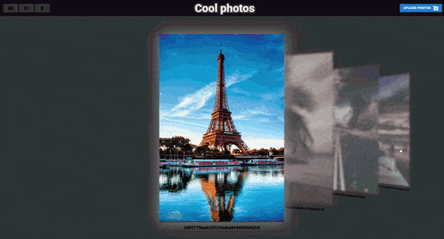

# Photo gallery 📸🖼️

> Store and enjoy your most favorite photos 🤩🤳🏼

### See the <a href='https://dnt-knw.github.io/Photo-gallery' target='_blank' title='Click to open the project'>Demo</a> 👁

## What you can do ❓

- 📜 Create and delete folders 📁
- 📜 Add photos to your folders and delete from them 🖼️📁
- 📜 Rename your photos 🖼️
- 📜 Download all your files at once or separately 📥
- 📜 Check the amount of occupied and free memory 💾

You will __learn more__ about how to use the app __inside of itself__

## Usage ⌨️

### 📝 The "Folders" button

📜 Opens the drawer navigator which contains your folders

### 📝 The "Home" button

📜 Returns you to the main page

### 📝 The "Remove mode" button

📜 Allows you to remove your photos

### 📝 The "Plus" button inside the drawer navigator

📜 Allows you to create a folder

### 📝 The "Download" button inside the drawer navigator

📜 Allows you to download your folder separately

### 📝 The "Remove" button inside the drawer navigator

📜 Allows you to remove your folder

### 📝 The "Download all" button inside the drawer navigator

📜 Allows you to download all folders you have

### 📝 The "Upload photos" input

📜 Allows you to upload your photos

## ❗️ About adding your photos ❗️

### There are 2 ways for photo adding 🖼️

- 📜 Using the "Upload photos" input
- 📜 Using the Drag & Drop inside your folder

## ❗️ What are the limitations? ❗️

### Strictly forbidden to use the following characters in the names of folders and photos ⛔️

- __Backslash__ ❌
- __Forward slash__ ❌
- __Dot__ ❌
- __Asterisk__ ❌
- __Question mark__ ❌
- __Two and more spaces__ ❌
- __One space at the end__ ❌

### Identical names ⛔

- __Folder names must be unique__ ✅
- __The names of the photos must be unique too__ ✅

📌 Keep in mind that you need to write a unique name __only for 1 photo format__. 
If you have "cool_photo.jpg", you cannot rename another photo to "cool_photo" name, if it __also has jpg format__. 
This means that "cool_photo.jpg" you can store __only in 1 copy__. And conversely, "cool_photo.jpg" and "cool_photo.png" are __completely different photos__ due to their different formats

📌 You don't see the photo format in the app, but if something goes wrong, __the app will warn you__ about it

## ❗️ Browser support ❗️

### I have tested my app in different browsers and below is the browser support

| Microsoft Edge | Google Chrome | Yandex browser | Mozilla Firefox  | Opera | Safari |
|------|------|------|------|------|------|
| Full support | Full support | Full support | Full support | Full support | Partial support |

📌 In particular, there are 2 problems on iOS

1. 🚫 The problem with renaming photos. In order for everything to work, you need to restart the app after renaming the photos
2. 🚫 The problem with memory access. There is no way to check the amount of occupied and free memory

Tested on the __latest versions__ of browsers ✅
